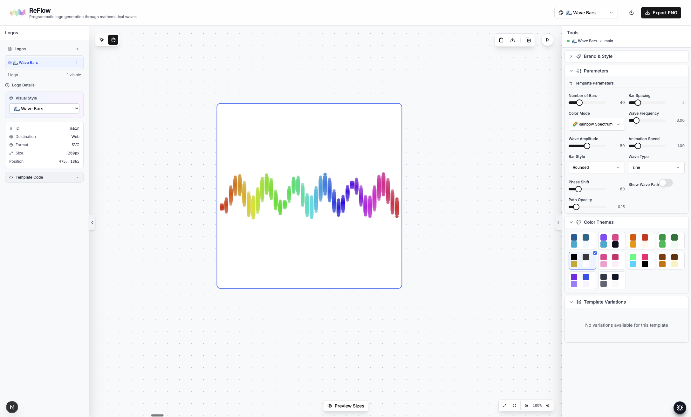

# ReFlow - The Future of Brand Identity

<div align="center">
  
</div>

## 🌊 Living Brands, Not Static Logos

Welcome to **ReFlow** - where brand identity evolves beyond static images into dynamic, programmatic art. Our revolutionary platform transforms mathematical waves into stunning visual identities that adapt, breathe, and respond while maintaining perfect brand consistency.

---

## 🎯 Why ReFlow?

### Traditional Logos Are Dead
Static logos can't capture the dynamism of modern brands. They sit lifeless on your website, unchanging and uninspiring.

### Enter ReFlow
Your brand identity becomes **living code** - mathematical DNA that generates infinite variations while maintaining your core identity.

---

## ✨ Features That Transform

### 🌈 **Dynamic Wave Visualizations**
Transform sound, data, or pure mathematics into stunning visual representations. The Wave Bars visualization shown above demonstrates how simple parameters create complex, beautiful patterns.

### 🔑 **Seed-Based Consistency**
Your brand's unique seed ensures perfect reproducibility. Same seed = same identity, every time.

### 🎨 **Real-Time Customization**
- **Frequency**: Control the rhythm of your brand
- **Amplitude**: Define your visual impact
- **Complexity**: From minimal to intricate
- **Chaos**: Add organic unpredictability
- **Colors**: Full spectrum or brand-locked palettes

### 💻 **Developer-Friendly**
```javascript
// Your brand as code
const brandIdentity = {
  seed: "your-company-2024",
  frequency: 3.0,
  amplitude: 50,
  colorMode: 'spectrum',
  style: 'wave-bars'
};
```

---

## 🚀 Use Cases

### **Tech Startups**
Dynamic logos that pulse with your API traffic or respond to user interactions.

### **Music Industry**
Visualizations that dance to your audio, creating unique experiences for every track.

### **Digital Agencies**
Showcase your creativity with logos that evolve throughout the day.

### **SaaS Products**
Brand identities that reflect system status, user activity, or data flows.

---

## 📊 Templates Gallery

### Wave Bars (Featured)
The vibrant spectrum visualization shown above - perfect for brands that want to showcase diversity, creativity, and energy.

### Other Popular Templates
- **🌐 Network Constellation** - Connected nodes for tech companies
- **💧 Liquid Flow** - Organic shapes for wellness brands  
- **⚛️ Quantum Field** - Scientific visualization for research firms
- **✨ Neon Glow** - Electric pulses for gaming brands
- **🔺 Geometric Prism** - Clean, mathematical precision

---

## 🛠️ Technical Excellence

### Built With Modern Stack
- **TypeScript** for type-safe development
- **Next.js** for blazing-fast performance
- **React** for interactive experiences
- **Canvas API** for smooth animations

### Export Formats
- **PNG** for immediate use
- **SVG** for scalable graphics (coming soon)
- **GIF** for animated versions
- **MP4** for video backgrounds

---

## 💡 How It Works

1. **Choose Your Template**
   Select from our growing library of mathematical visualizations

2. **Set Your Seed**
   Your unique identifier that makes the design yours

3. **Customize Parameters**
   Fine-tune every aspect of your visual identity

4. **Generate & Export**
   Download in multiple formats for every use case

---

## 🌟 What Makes Us Different

### **Not Just Another Logo Maker**
ReFlow doesn't use pre-made assets or clip art. Every pixel is mathematically generated, making your brand truly unique.

### **Consistency Meets Flexibility**
Your seed ensures brand consistency while parameters allow contextual adaptation.

### **Open Source Core**
Built on open principles with a thriving developer community.

---

## 📈 Pricing

### **Free Tier**
- Access to all templates
- PNG exports
- Basic customization
- Community support

### **Pro Tier** (Coming Soon)
- SVG & video exports
- Advanced parameters
- API access
- Custom templates
- Priority support

### **Enterprise** (Coming Soon)
- White-label options
- Custom development
- SLA guarantees
- Dedicated support

---

## 🎉 Join the Revolution

Ready to give your brand a living identity? ReFlow is currently in beta, and we're looking for forward-thinking companies to join us in redefining what brand identity means in the digital age.

<div align="center">
  <h3>🚀 Start Creating at <a href="https://reflow.app">reflow.app</a></h3>
  <p><em>Transform your brand from static to spectacular</em></p>
</div>

---

<div align="center">
  <p>Made with 💜 by creators who believe brands should be as dynamic as the companies they represent</p>
</div>